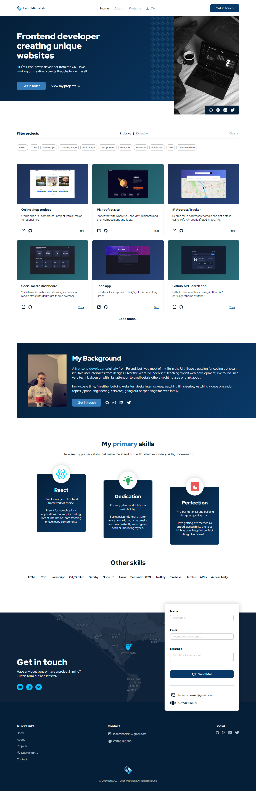
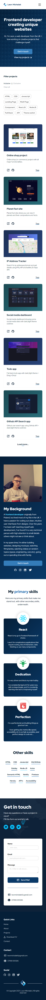

# What is this project?

- My portfolio site. Contains my projects, my CV, ways to contact me & about me.
- Live Site URL: (https://leonmichalak.dev/)

## Built with

- Semantic HTML5 markup
- CSS custom properties/vars
- Desktop-first workflow
- CSS Grid/Flexbox
- Gatsby SSG

## Features

- Routing
- Project filtering system with tabs
- Responsive design

## Screenshots

<!--  -->
<!--  -->

## Lessons Learned

Not finished yet :)

## Colours used

| Color           | Hex                                                              |
| --------------- | ---------------------------------------------------------------- |
| Primary Darkest |  #051f38 |
| Primary Dark    |  #093968 |
| Primary         |  #03549a |
| Primary Light   |  #347cb9 |
| Secondary       |  #5ed4fb |
| Black           |  #041a2f |
| Gray Darkest    |  #737373 |
| Gray Dark       |  #bdbdbd |
| Gray            |  #e0e0e0 |
| White           |  #f6fafe |

## Author

- Website - [Leon Michalak](https://www.leonmichalak.dev)
- Instagram - [@TheFrontendGuy](https://www.instagram.com/TheFrontendGuy/)
- Twitter - [@TheFrontendGuyX](https://www.twitter.com/TheFrontendGuyX/)
